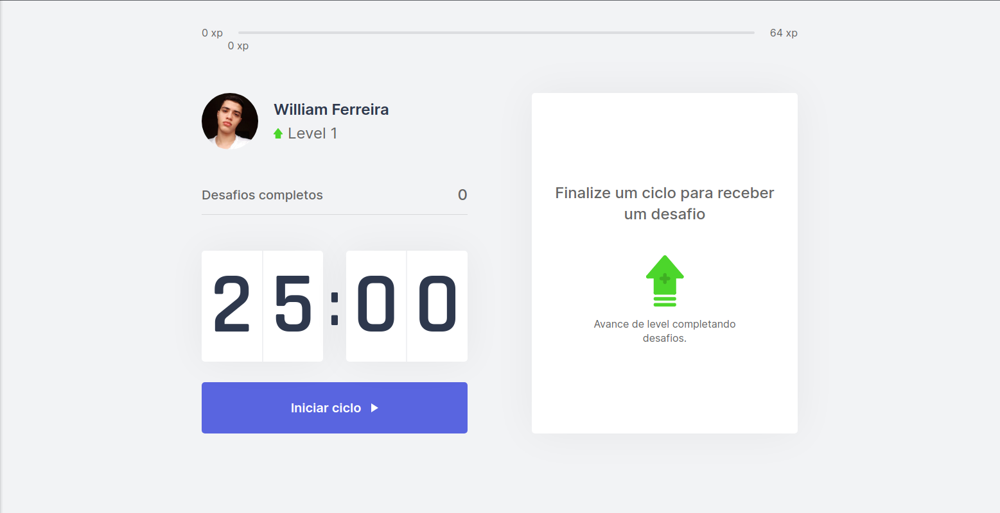
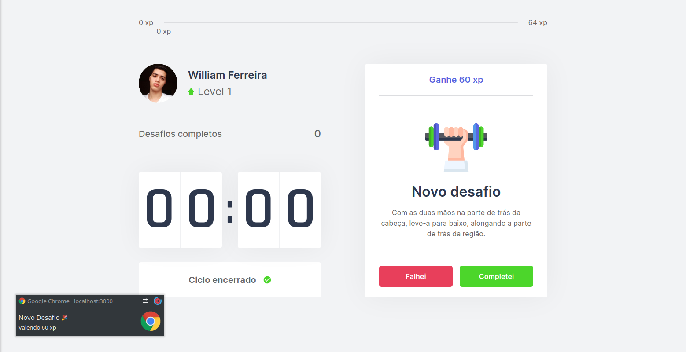
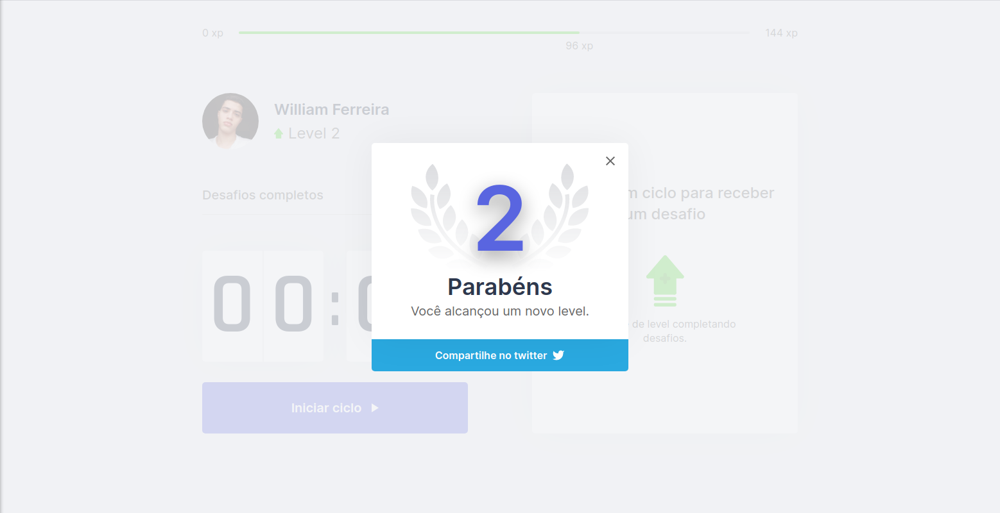

# Shake.it
As the time passes by, we can more easily notice the effects of the life style that the majority of the devs live, a sedentary life. Back pain, eyes problems, muscles pain and the list goes on and on. This app comes to help the communit to try starting new healthy habits.

## Table of contents
* [General info](#general-info)
* [Screenshots](#screenshots)
* [Technologies](#technologies)
* [Setup](#setup)
* [Features](#features)
* [Status](#status)
* [Inspiration](#inspiration)
* [Contact](#contact)

## General info
Adapting the pomodoro method, this app keeps track of time, when started after 25(twenty-five) minutes you recieve an alert and unlock a new challenge, if you complete it, you'll recieve experience. Collect enough xp to level up and share on Twitter if you want to.

## Screenshots




## Technologies

* js-cookie: ^2.2.1
* next: 10.0.7
* react: 17.0.1
* yarn: 1.22.10

## Setup
Describe how to install / setup your local environement / add link to demo version.

If you want to run this code in your local machine, download this repository and inside it, download it's dependencies.
Then, run the code with  ```yarn dev``` in the root of the repository.

You can access the demo version of the page on [https://shakeit-six.vercel.app/](https://shakeit-six.vercel.app/)

## Features
* You can share your achievements on twitter.
* All your progress is saved for further access.
* Complete the challenges and help your health.

To-do list:
* System of login and sign up.
* Ranking with all users system.

## Status
Project is: _in progress_, this is just a demo, it will be feeded and developed in the future.

## Inspiration
This was a project developed with [RockeatSeat](https://app.rocketseat.com.br/dashboard), during the Next Level Week event, a workshop with the intention of helping and the dev communit through education, dedication and will. 

## Contact
Created by [William Ferreira](https://www.linkedin.com/in/william-ferreira-3629a61b0/) - feel free to contact me!
